# AI Full Stack Explained（繁體中文筆記版）

這份文件整理了 AI 系統的完整技術棧（Full AI Stack），從基礎模型到推理接入、代理框架、工具協議、記憶、向量資料庫、Embedding、資料抽取，以及評估與可觀測性，呈現出一個完整的 AI 實作生態。

---

## 1. 整體概念

AI 不只是單一模型，而是一個完整的技術堆疊。  
一個真正可運作的 AI 應用，通常需要以下能力：

- 基礎模型能力（LLMs）
- 推理與 API 接入能力
- Agent / Workflow 編排能力
- 工具與外部系統整合能力
- 記憶與長期上下文能力
- 語義檢索與知識儲存能力
- 資料抽取與處理能力
- 品質評估與監控能力

---

## 2. 技術棧架構圖

```mermaid
flowchart TB
    subgraph L1["1. LLMs"]
        L1A["OpenAI<br/>Claude<br/>Gemini<br/>Grok<br/>DeepSeek<br/>Qwen<br/>Kimi<br/>Mistral<br/>Gemma<br/>Meta"]
    end

    subgraph L2["2. Inference & Access"]
        L2A["Hugging Face<br/>OpenRouter<br/>Together AI<br/>Fireworks AI<br/>Groq<br/>Ollama<br/>LM Studio<br/>vLLM<br/>SGLang"]
    end

    subgraph L3["3. Agent Frameworks"]
        L3A["LangGraph<br/>LangChain<br/>CrewAI<br/>AutoGen<br/>Haystack<br/>Mastra<br/>Semantic Kernel"]
    end

    subgraph L4["4. Tools & Protocols"]
        L4A["MCP<br/>A2A<br/>Exa<br/>Tavily<br/>Browserbase<br/>E2B"]
    end

    subgraph L5["5. Memory"]
        L5A["Mem0<br/>Zep<br/>LangMem<br/>Supermemory<br/>Cagnee"]
    end

    subgraph L6["6. Vector Databases"]
        L6A["Postgres<br/>Pinecone<br/>Qdrant<br/>Milvus<br/>Weaviate<br/>pgvector"]
    end

    subgraph L7["7. Embeddings & Rerankers"]
        L7A["OpenAI Embeddings<br/>Gemini Embedding<br/>Voyage AI<br/>Cohere<br/>Qwen3<br/>Jina AI<br/>SBERT<br/>BGE"]
    end

    subgraph L8["8. Data Extraction"]
        L8A["Firecrawl<br/>Docling<br/>LlamaParse<br/>Reducto<br/>Unstructured<br/>Mistral OCR"]
    end

    subgraph L9["9. Eval & Observability"]
        L9A["Langfuse<br/>LangSmith<br/>Braintrust<br/>Phoenix<br/>DeepEval<br/>Promptfoo<br/>OpenTelemetry<br/>Ragas"]
    end

    L1 --> L2 --> L3 --> L4 --> L5 --> L6 --> L7 --> L8 --> L9
```

---

## 3. 分層說明

### 1) LLMs（大語言模型）
最上層是大語言模型本身，例如 OpenAI、Claude、Gemini、DeepSeek 等。  
這一層決定了語言理解、推理與生成能力。

### 2) Inference & Access（推理與接入）
這層處理模型的部署與存取，讓模型可以被 API 調用並進行推理。  
常見工具包含 Hugging Face、OpenRouter、Groq、Ollama 等。

### 3) Agent Frameworks（代理框架）
這層讓模型變成能執行多步任務的 Agent。  
例如 LangChain、LangGraph、CrewAI、AutoGen 等，提供任務規劃、工具調用與工作流協調能力。

### 4) Tools & Protocols（工具與協議）
這層是模型與外部系統互動的橋樑，包含 MCP、A2A、Exa、Tavily 等。  
這些協議讓 AI 可以呼叫搜尋、瀏覽器、API、資料庫與其他工具。

### 5) Memory（記憶）
讓 AI 能保存上下文、使用者偏好與長期知識。  
例如 Mem0、Zep、LangMem 等，都是記憶層的代表。

### 6) Vector Databases（向量資料庫）
支援向量存儲與相似性搜尋，讓系統能進行語義檢索。  
常見工具包括 Pinecone、Milvus、Qdrant、Weaviate、pgvector 等。

### 7) Embeddings & Rerankers（Embedding 與重排器）
這層將文本轉成向量，藉由語義相似度實現搜尋召回與排序。  
例如 OpenAI Embeddings、Cohere、SBERT、Jina AI、Voyage AI 等。

### 8) Data Extraction（資料抽取）
從網頁、PDF、文檔或非結構化資料中抽取資訊，讓 AI 有原始材料使用。  
常見工具包括 Firecrawl、LlamaParse、Unstructured、Docling 等。

### 9) Eval & Observability（評估與可觀測性）
這層關注 AI 系統的輸出品質、成本、延遲、錯誤、信心度與可觀測性。  
常見工具包括 Langfuse、LangSmith、Braintrust、DeepEval、Ragas 等。

---

## 4. 核心觀點

這份技術棧展示了一個重要觀念：

> AI 的能力不只來自模型本身，而來自整個技術棧的協同運作。

真正可用的 AI 應用，需要：
- 強大的模型
- 快速可靠的推理服務
- Agent 工作流
- 工具協定整合
- 知識儲存與檢索
- 資料抽取與處理
- 評估與監控

---

## 5. 總結

這張圖可以視為 AI 產業的全景圖。  
它把 AI 相關技術分層，幫助我們理解：

- 模型在哪裡
- 應用如何接入
- Agent 如何運作
- 知識與資料如何被召回
- 系統如何被監控與驗證

一個成熟的 AI 系統，不只是「有模型」，而是一整套工程化架構。

---

## 6. 參考分層（原圖分類）

- LLMs
- Inference & Access
- Agent Frameworks
- Tools & Protocols
- Memory
- Vector Databases
- Embeddings & Rerankers
- Data Extraction
- Eval & Observability