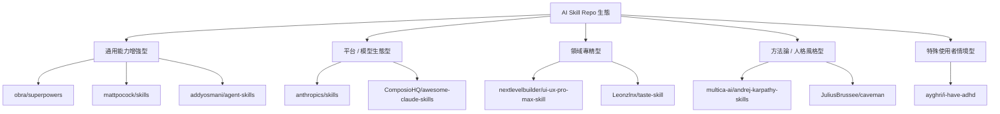

# AI Skill Repo 類型地圖

以下內容根據圖片中的 10 個 GitHub repository 名稱，推測其可能的內容類型，並整理成一份視覺化分類圖。這是**名稱推測版**，不是實際內容驗證版。

---

## 1. Repo 類型推測表

| 排名 | Repository | 可能內容類型 | 推測理由 |
|---|---|---|---|
| 1 | `obra/superpowers` | AI 能力增強包 / Prompt 技能集 | `superpowers` 常用來表示讓 AI 變強的一組能力 |
| 2 | `mattpocock/skills` | 通用技能模板 / 工作流合集 | 名稱最泛，像是整理一套可重用技能 |
| 3 | `multica-ai/andrej-karpathy-skills` | 名人風格的 AI 使用技巧集 / 代理指令集 | 直接掛上 Karpathy 名字，像是個人風格或方法論整理 |
| 4 | `anthropics/skills` | 官方或準官方技能框架 / 範例集合 | `anthropics` + `skills` 很像官方生態中的能力模組 |
| 5 | `nextlevelbuilder/ui-ux-pro-max-skill` | UI/UX 相關 agent 技能包 | 名稱直接包含 UI/UX，應該聚焦設計工作流 |
| 6 | `JuliusBrussee/caveman` | 極簡模式 / 低依賴工作方式 / 原始風格工具 | `caveman` 暗示很原始、極簡、回到本質的做法 |
| 7 | `addyosmani/agent-skills` | Agent 實用技能集合 / 任務執行指南 | `agent-skills` 很直白，應該是提高 agent 執行能力 |
| 8 | `Leonzlnx/taste-skill` | 審美 / 品味導向技能 | `taste` 常被用來描述設計、判斷力、偏好 |
| 9 | `ComposioHQ/awesome-claude-skills` | Claude 技能資源清單 / 精選彙整 | `awesome-` 命名通常是 curated list |
| 10 | `ayghri/i-have-adhd` | 專注力輔助 / 任務切分 / ADHD 友善工作流 | 名稱強烈暗示工作分解與注意力管理 |

---

## 2. AI Skill Repo 類型地圖

### 類型 A：通用能力增強型
**核心目的：** 讓 AI 更會做事  
**代表 repo：**
- `obra/superpowers`
- `mattpocock/skills`
- `addyosmani/agent-skills`

**特徵：**
- 名稱直接、抽象
- 常見於 prompt engineering、agent instruction、task pattern
- 適合被廣泛複用

---

### 類型 B：平台 / 模型生態型
**核心目的：** 圍繞特定模型或平台整理技能  
**代表 repo：**
- `anthropics/skills`
- `ComposioHQ/awesome-claude-skills`

**特徵：**
- 綁定特定 LLM 生態
- 通常更像資源集合、官方示例、 curated list
- 易形成社群入口

---

### 類型 C：領域專精型
**核心目的：** 針對某個工作領域優化 agent  
**代表 repo：**
- `nextlevelbuilder/ui-ux-pro-max-skill`
- `Leonzlnx/taste-skill`

**特徵：**
- 面向設計、判斷、內容、創作等特定任務
- 技能內容通常比較場景化
- 可直接改善某類工作效率

---

### 類型 D：方法論 / 人格風格型
**核心目的：** 用某種思考風格塑造 AI 行為  
**代表 repo：**
- `multica-ai/andrej-karpathy-skills`
- `JuliusBrussee/caveman`

**特徵：**
- 強調某種思維方式
- 可能是「像某人一樣思考」或「以某種方式簡化」
- 很適合社群傳播

---

### 類型 E：特殊使用者情境型
**核心目的：** 解決特定使用情境或認知需求  
**代表 repo：**
- `ayghri/i-have-adhd`

**特徵：**
- 關注注意力、節奏、任務切換
- 通常偏向輔助型 agent / personal workflow
- 很可能更重視可執行性而非抽象框架

---

## 3. 視覺化分類圖（Mermaid）

---

## 4. 生態趨勢分析

這批 repo 類型大致反映了 AI skill 社群正在往幾個方向發展：

1. **從單一 prompt 走向可重用能力模組**
2. **從通用 agent 走向領域專精**
3. **從工具使用走向思維風格塑造**
4. **從技術導向走向個人化工作流**
5. **從模型能力走向人機協作設計**

---

## 5. 一句話總結

AI skills 正從「怎麼問模型」進化成「怎麼封裝一套可重用、可傳播、可個人化的智能工作能力」。
